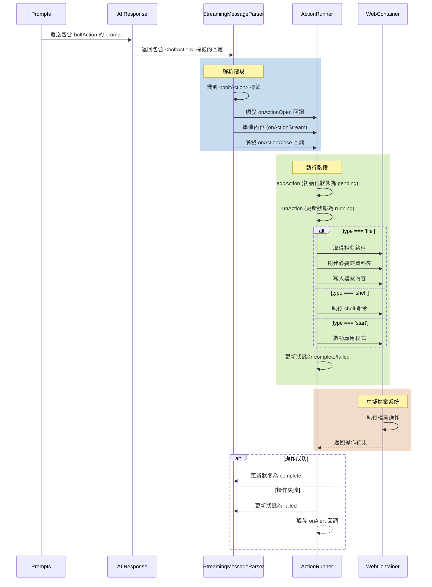

# Bolt.DIY 系統分析：boltAction 運作機制

本文檔分析了 Bolt.DIY 中 boltAction 的運作機制，特別是關於檔案生成和內容處理的部分。

## 相關檔案路徑

- `/app/lib/stores/workbench.ts` - WorkbenchStore 實作，負責處理檔案操作
- `/app/lib/runtime/message-parser.ts` - StreamingMessageParser 實作，負責解析 AI 回應
- `/app/lib/hooks/useMessageParser.ts` - 處理串流訊息的 Hook
- `/app/lib/common/prompts/prompts.ts` - 包含 boltAction 標籤使用的範例

## boltAction 標籤結構

```html
<boltAction type="file" filePath="index.html">...</boltAction>
<boltAction type="file" filePath="src/main.jsx">...</boltAction>
<boltAction type="file" filePath="src/index.css">...</boltAction>
<boltAction type="file" filePath="src/App.jsx">...</boltAction>
<boltAction type="start">npm run dev</boltAction>
```

## 檔案生成流程

1. **檔案操作處理**
   - 通過 WebContainer 取得工作目錄
   - 組合完整的檔案路徑
   - 切換編輯器到目標檔案
   - 切換到程式碼視圖
   - 檢查檔案是否存在
   - 執行檔案創建操作
   - 更新編輯器內容
   - 重置檔案修改狀態（非串流模式）

2. **串流內容生成機制**
   - StreamingMessageParser 解析 AI 回應
   - 識別 `<boltAction>` 標籤時進入串流模式
   - 持續接收和解析 AI 生成的內容
   - 對非 markdown 檔案清理格式
   - 通過 onActionStream 更新編輯器內容
   - 觸發相關回調（onActionOpen/onActionClose）

## 主要元件

1. **WebContainer**
   - 提供虛擬化的檔案系統環境
   - 確保檔案操作的安全性和隔離性

2. **WorkbenchStore**
   - 管理工作區狀態
   - 處理檔案和編輯器操作

3. **StreamingMessageParser**
   - 解析 AI 回應內容
   - 管理串流狀態
   - 處理檔案內容格式化

4. **ActionRunner**
   - 執行具體的 action 操作
   - 管理操作生命週期

## 串流特點

1. **即時性**
   - 檔案內容逐步生成
   - 立即更新到編輯器
   - 使用者可即時查看生成進度

2. **效能優勢**
   - 減少等待時間
   - 有效處理大型檔案
   - 提供流暢的使用者體驗

## 結論

